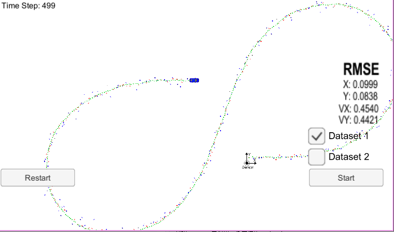

# A Discussion on Keeping the Angle Pseudo Measurement Between (-pi,pi]

Tracking a moving object with an extended Kalman filter is a standard exercise which is widely used in colleges. However, there exists an exciting discussion about the subtraction in the Kalman filter innovation. When the radar data is used to update the estimate, we should subtract the measured angle from the supposed angle, which gives a part of the Kalman innovative. The angle that is supposed to be measured is called pseudo-measurement. The guideline from the Udacity suggests that we should keep the angle pseudo-measurement between . We would like to provide an explanation that why it is necessary. 

The variable in innovation should tell the filter whether the measure is bigger or smaller than the pseudo-measurement. If it is bigger, the associated variable in the innovation should be positive. Otherwise, the related variable should be negative. The absolute value of the innovation is not crucial, so long as it is proportionate to the difference between the real measurement and pseudo-measurement. So, everything in the innovation should adequately reflect this information. Furthermore, whether an actual measurement is bigger or smaller than the pseudo-measurement is defined by the user. But, once it is determined, it should be consistent in the working area of the filter. 

One angle subtracts another is equal to the smaller angle which is needed when turning the second vector to the first one. The counter-clockwise turning means positive, and the clockwise turning means negative. 

In the above figure, the vector B performs a counter-clockwise turning until it is overlapped with vector A. The angle through which the vector B turns is the difference, which is positive. Directly subtraction angle B from angle A gives the right result in this condition. The calculation is working. Unfortunately, if two angles in  are subtracted from one to another, an inappropriate result can be generated. Take the following figure as an example. 

The angle  is as big as it in the previous figure. However, , and . Directly subtracting angle B from angle A gives a negative value, which will misguide the Kalman filter. 

The idea from Udacity is efficient. By converting any angle to , the difference of two angles is just appropriate for the filter. However, it is also possible to calculate the smaller angle from vector B to the vector A. 

A vector with angle  and length one can be expressed by a rotation matrix , and we can turn this vector  radians by multiply another rotation matrix. 

<a href="https://www.codecogs.com/eqnedit.php?latex=$=\left[&space;\begin{matrix}&space;\cos&space;(\alpha&space;)&space;&&space;-\sin&space;(\alpha&space;)&space;\\&space;\sin&space;(\alpha&space;)&space;&&space;\cos&space;(\alpha&space;)&space;\\&space;\end{matrix}&space;\right]$$\left[&space;\begin{matrix}&space;\cos&space;(\theta&space;)&space;&&space;-\sin&space;(\theta&space;)&space;\\&space;\sin&space;(\theta&space;)&space;&&space;\cos&space;(\theta&space;)&space;\\&space;\end{matrix}&space;\right]$" target="_blank"></a>

<a href="https://www.codecogs.com/eqnedit.php?latex=$=\left[&space;\begin{matrix}&space;\cos&space;(\alpha&space;)\cos&space;(\theta&space;)-\sin&space;(\alpha&space;)\sin&space;(\theta&space;)&space;&&space;-(\cos&space;(\alpha&space;)\sin&space;(\theta&space;)&plus;\sin&space;(\alpha&space;)\cos&space;(\theta&space;))&space;\\&space;\sin&space;(\alpha&space;)\cos&space;(\theta&space;)&plus;\cos&space;(\alpha&space;)\sin&space;(\theta&space;)&space;&&space;-\sin&space;(\alpha&space;)\sin&space;(\theta&space;)&plus;\cos&space;(\alpha&space;)\cos&space;(\theta&space;)&space;\\&space;\end{matrix}&space;\right]$" target="_blank"></a>

So, . At last, the  function is used to retrieve the angle, which is . 

The associated codes use above methods to provide a theoretical solution, and the way in Udacity is the most efficient. 

